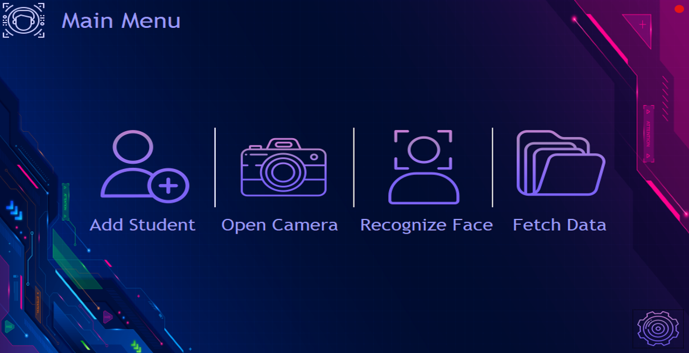
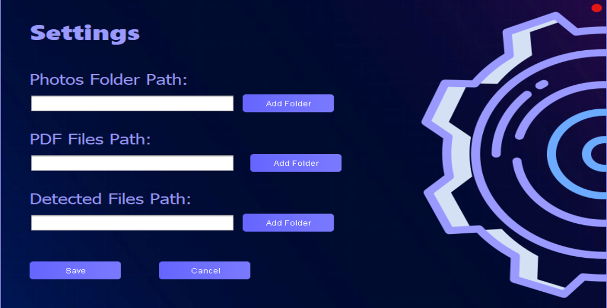
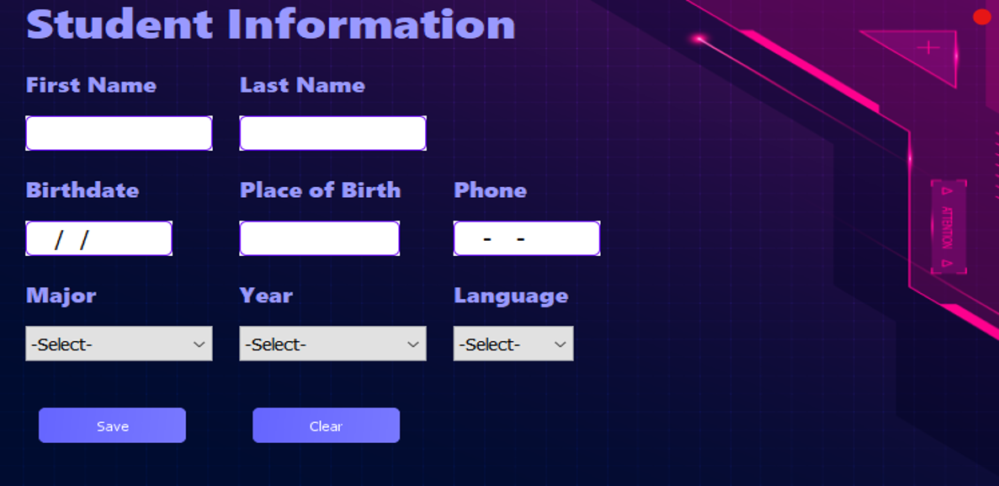
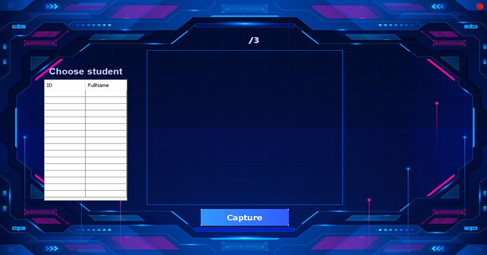
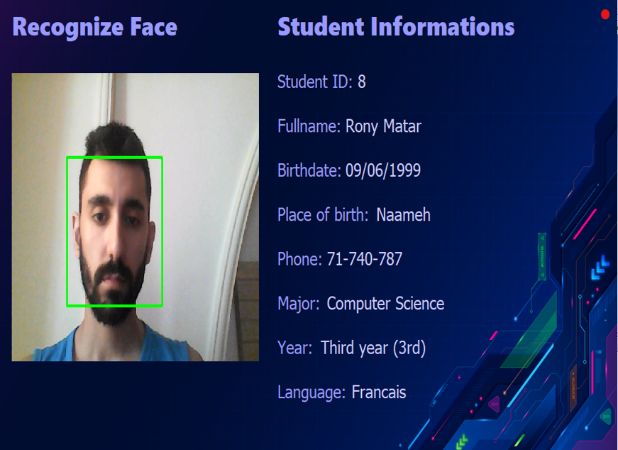
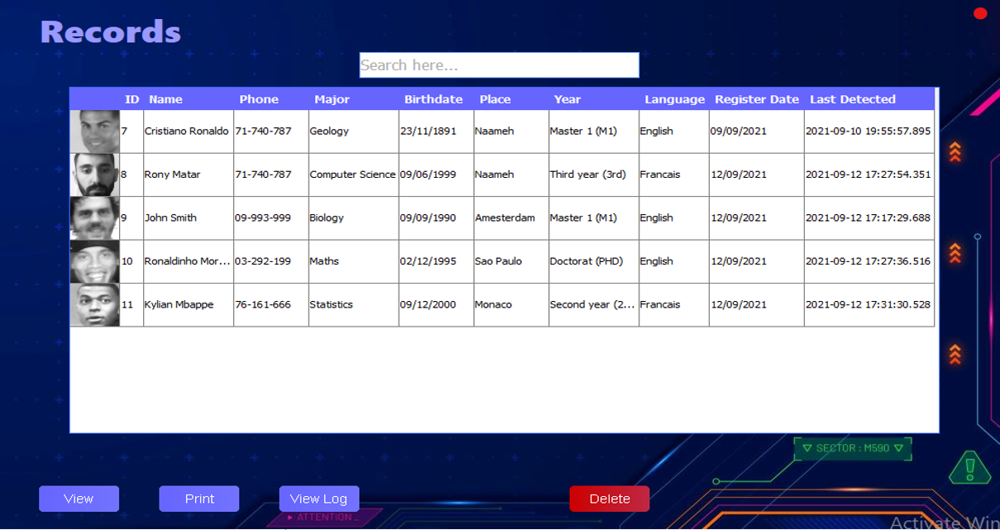
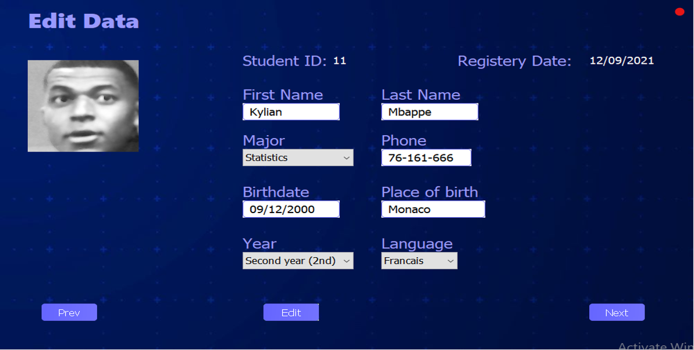
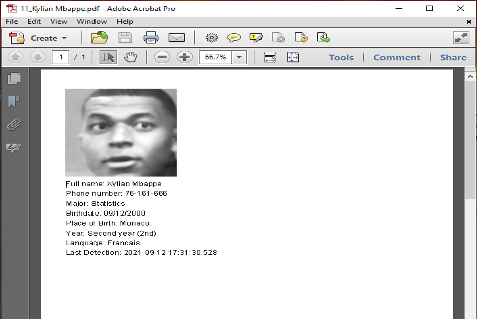

# Facial Recognition v3

Detect and recognize faces using an interface in Java


## Getting Started

To understand how to implement this project on your system, follow the next steps!

### Prerequisites

What you need for the project to work

```
Java 1.8 or greater
Netbeans 8.2 or greater
```

## Database

```
In the project there is a file called: facial_recognition.sql, create a database named "facial_recognition" and import this file.
Login: admin, admin
Note: you may need to change a little in the code the database path and other thing...
```

## Libs

* JavaCV 1.5.1: https://github.com/bytedeco/javacv/releases
```
Extract javacv-bin in C:/
Then we need to make sure that the haarcascade and lbpcascade paths from C:\opencv\sources\data are right in the src code

Import:

OpenCV-Windows-x86_64
Openlabs-windows-x86_64

```
### Installing KGrandient


Open Netbeans Create your Swing application, head to Palette right click and select Palette Manager select Add From Jar and browse to the location of the downloaded jar file. Select and proceed, select KGradientPanel component proceed to select the category and hit Finish. <br/>
Open your JFrame drag KGradientPanel to it and set the following properties in the properties window.

### Project Images

* Login

* Main Menu

* Settings

* Add Student

* Open Camera

* Recognize Face

* Fetch Data

* Edit Data

* Printed Data

